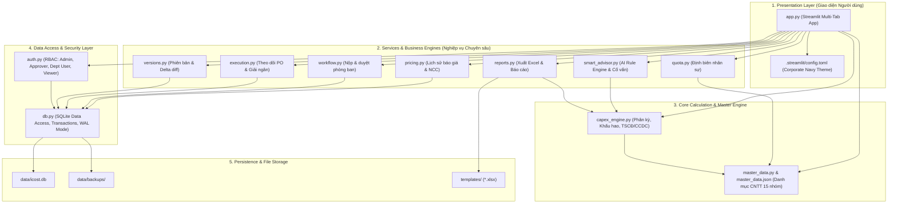

# KIẾN TRÚC DỰ ÁN I-COST (CAPEX & IT BUDGETING SYSTEM)
**Tập đoàn Đại Dũng (DDC) — Hệ Thống Quản Lý & Lập Ngân Sách Đầu Tư CNTT**

---

## 1. Cấu trúc Thư mục Chuẩn Hóa (Standardized Directory Layout)

```
d:\DATA\dev\I_Cost\
├── .streamlit/                     # Cấu hình môi trường Streamlit & giao diện
│   ├── config.toml                 # Theme (Corporate Navy), port, layout options
│   └── secrets.toml (nếu có)       # Thông tin bảo mật nội bộ (bị .gitignore)
├── data/                           # Dữ liệu hoạt động hệ thống
│   ├── icost.db                    # CSDL SQLite chính (ngân sách, workflows, audit logs)
│   ├── backups/                    # Bản sao lưu CSDL (.db, .zip) theo thời gian
│   └── archive/                    # Dữ liệu lịch sử, dump & scratch tạm thời
├── docs/                           # Tài liệu kỹ thuật & Hướng dẫn triển khai
│   ├── ARCHITECTURE.md             # Tài liệu kiến trúc toàn diện (tài liệu này)
│   └── DEPLOY_STREAMLIT_CLOUD.md   # Hướng dẫn triển khai Streamlit Community Cloud
├── templates/                      # Biểu mẫu Excel kế toán & định biên mẫu
│   ├── 2. Form file nhập liệu CAPEX 2026.xlsx
│   ├── 2. Form file nhập liệu CAPEXbd.xlsx
│   ├── Phân tích nhu cầu CNTT theo định biên 2027.xlsx
│   └── Tổng hợp định biên 2027 toàn Tập đoàn - Gửi CNTT.xlsx
├── tests/                          # Bộ kiểm thử tự động (Unit & Integration tests)
│   ├── __init__.py                 # Cấu hình môi trường test cách ly (in-memory SQLite)
│   ├── fixtures.py                 # Dữ liệu mẫu test sinh từ master_data.json
│   ├── test_app_helpers.py         # Kiểm thử các hàm tiện ích lọc & xử lý UI
│   ├── test_budget_execution.py    # Kiểm thử theo dõi thực hiện ngân sách & PO
│   ├── test_capex_engine.py        # Kiểm thử tính toán khấu hao, phân kỳ, định biên
│   ├── test_database.py            # Kiểm thử CSDL SQLite, schema migrations, audit
│   ├── test_department_status.py   # Kiểm thử quy trình nộp/khóa phòng ban
│   ├── test_price_history.py       # Kiểm thử lịch sử giá & cập nhật báo giá
│   ├── test_reports.py             # Kiểm thử tổng hợp báo cáo tài chính & khối
│   └── test_versions.py            # Kiểm thử snapshot phiên bản & so sánh delta
├── app.py                          # Streamlit UI Presentation Layer (11 Tabs)
├── auth.py                         # Authentication, SSO/Email, Role-based Access (RBAC)
├── capex_engine.py                 # Core Business Logic (Tính toán khấu hao, phân kỳ, thẩm định)
├── db.py                           # Data Access Layer (SQLite ORM-light, schema, audit)
├── master_data.py                  # Quản lý danh mục CNTT 15 nhóm, đơn vị, phòng ban → khối
├── master_data.json                # Master database JSON (Danh mục chuẩn 222 hạng mục)
├── pricing.py                      # Quản lý đơn giá tham chiếu, lịch sử báo giá nhà cung cấp
├── quota.py                        # Phân tích định biên nhân sự CNTT & tự động sinh dự toán
├── reports.py                      # Tổng hợp báo cáo, xuất Excel đa dạng theo mẫu DDC
├── execution.py                    # Theo dõi giải ngân, đối soát PO/hóa đơn thực tế
├── versions.py                     # So sánh phiên bản ngân sách (Bản duyệt, Điều chỉnh lần N)
├── workflow.py                     # Nộp & duyệt phòng ban, khóa phòng đã nộp/duyệt, tiến độ
├── smart_advisor.py                # AI Rule Engine & Cố vấn tối ưu chi phí thông minh
├── requirements.txt                # Danh sách thư viện phụ thuộc
├── run_app.bat                     # Script khởi chạy 1-click cho người dùng Windows
└── README.md                       # Hướng dẫn sử dụng & giới thiệu hệ thống
```

---

## 2. Kiến trúc Phân tầng (Layered Architecture)

Hệ thống tuân thủ mô hình phân tầng **Separation of Concerns (SoC)**:



---

## 3. Danh mục Modules & Trách nhiệm

| Module | Trách nhiệm chính | Phụ thuộc chính |
| :--- | :--- | :--- |
| **`app.py`** | Giao diện chính Streamlit 11 tab: Dashboard, Lập ngân sách, Định biên, Danh mục, Phiên bản, Thẩm định, Báo cáo, PO Giải ngân, Phê duyệt, Báo giá, Quản trị hệ thống. | Toàn bộ service modules |
| **`auth.py`** | Xác thực người dùng, phân quyền 4 vai trò (`admin`, `approver`, `dept_user`, `viewer`), quản lý session, hash mật khẩu. | `db.py` |
| **`db.py`** | Kết nối CSDL SQLite, migrations bảng biểu, audit logging, sao lưu/khôi phục tự động, quản trị chứng từ. | `sqlite3` |
| **`capex_engine.py`** | Thuật toán phân kỳ giải ngân (tháng, quý, đều), hạch toán kế toán (TSCĐ ≥ 30 triệu vs CCDC vs Chi phí), tính khấu hao theo Thông tư 45/2013/TT-BTC. | `master_data.py` |
| **`master_data.py`** | Quản lý 15 nhóm CNTT với 222 hạng mục tiêu chuẩn, đơn giá tham chiếu, đơn vị tính, bảng 62 phòng ban → khối (từ file định biên). | `master_data.json` |
| **`smart_advisor.py`** | Bộ quy tắc phân tích tối ưu: cảnh báo vượt ngân sách, đề xuất gộp đơn hàng số lượng lớn, đối chiếu khấu hao, gợi ý linh kiện thay thế. | `capex_engine.py` |
| **`quota.py`** | Nhập file định biên nhân sự (`templates/`), phân tích trang thiết bị theo chức danh (Kỹ sư CAD, NV Văn phòng, Giám đốc) và tự động sinh danh mục thiết bị. | `master_data.py`, `pandas` |
| **`pricing.py`** | Quản lý nhà cung cấp, lịch sử biến động giá theo quý/năm, cập nhật đơn giá thị trường vào Master Catalog. | `db.py` |
| **`workflow.py`** | Nộp & duyệt: Phòng ban nộp ➔ IT site duyệt / trả lại từng phòng ➔ IT site nộp site (khi đủ phòng đã duyệt) ➔ Admin duyệt site (chốt phiên bản); khóa sửa phòng đã nộp / duyệt. | `db.py` |
| **`execution.py`** | Theo dõi thực tế giải ngân: so sánh Ngân sách dự toán vs PO ký kết vs Nghiệm thu thực tế vs Hóa đơn GTGT. | `db.py` |
| **`versions.py`** | Snapshot phiên bản ngân sách (Kế hoạch V1, Trình duyệt V2, Chính thức), so sánh sai lệch (variance analysis). | `db.py` |
| **`reports.py`** | Xuất báo cáo Excel theo đúng biểu mẫu tài chính DDC, báo cáo theo Khối, biểu đồ trực quan. | `openpyxl`, `xlsxwriter` |

---

## 4. Cơ chế Độc lập & Tương thích Môi trường (Compatibility)

1. **Đường dẫn Động (Dynamic Path Resolution)**:
   - Tất cả module sử dụng đường dẫn tương đối hoặc `Path(__file__).resolve().parent` để xác định vị trí file.
   - Thư mục biểu mẫu `templates/` được phân giải tự động bằng hàm `resolve_template_path()`, có fallback về thư mục gốc nếu chạy ở môi trường cũ.

2. **Cách ly Dữ liệu Kiểm thử (Test Isolation)**:
   - Thư mục `tests/` cấu hình biến môi trường `ICOST_DB_PATH` trỏ tới database tạm thời (`:memory:` hoặc file temp).
   - Tuyệt đối không đọc/ghi đè lên dữ liệu sản xuất tại `data/icost.db`.

3. **Cơ chế Triển khai Linh hoạt**:
   - Chạy offline nội bộ: Khởi chạy nhanh bằng `run_app.bat` trên Windows.
   - Chạy trên Cloud: Đáp ứng 100% chuẩn triển khai Streamlit Cloud / Docker theo hướng dẫn tại [docs/DEPLOY_STREAMLIT_CLOUD.md](file:///d:/DATA/dev/I_Cost/docs/DEPLOY_STREAMLIT_CLOUD.md).
